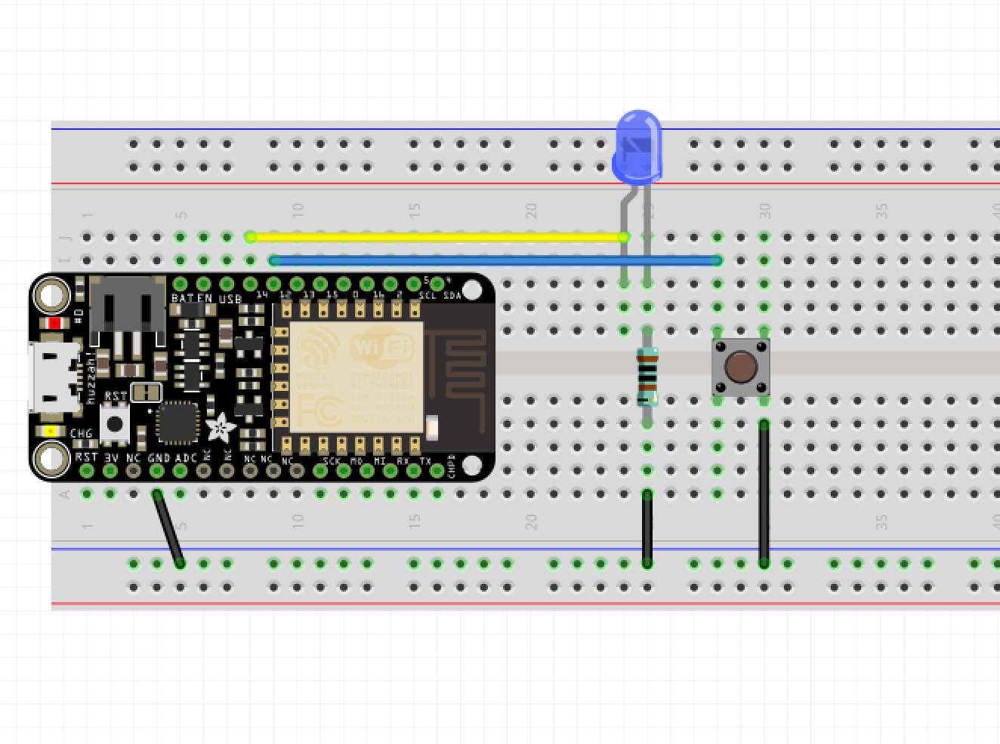

# Project 02 - Add a button for input




```cpp
const int LEDPIN = 14;
const int BUTTONPIN = 12;

void setup()
{
    pinMode(LEDPIN, OUTPUT);
    pinMode(BUTTONPIN, INPUT_PULLUP);

    // To use the code below, connect the pin on the same side as your
    // input pin to power, with a resistor.
    // You need to provide a default value, and this is another way to do that.
    // pinMode(BUTTONPIN, INPUT);
}

void loop()
{
    if (digitalRead(BUTTONPIN) == LOW) {
        digitalWrite(LEDPIN, HIGH);
    } else {
        digitalWrite(LEDPIN, LOW);
    }
}
```
