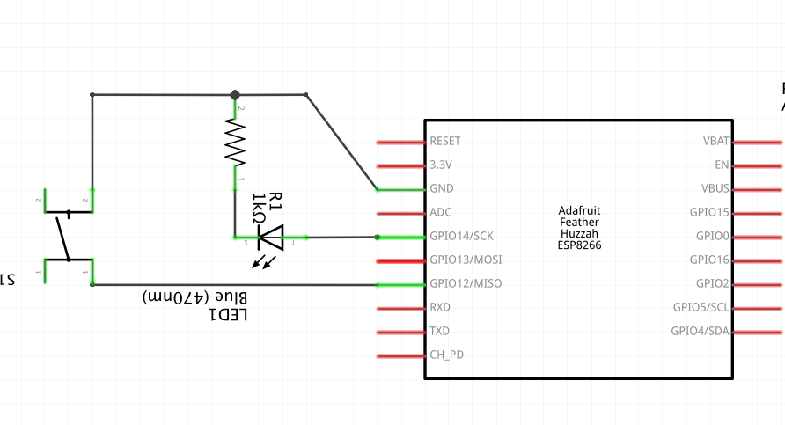

# Project 02 - Add a button for input




If you want to know how the pins in the diagram correspond to the pins on your actual button you can use a multimeter.

Buttons are a type of tactile switch called a "momentary tactile switch" because the circuit is closed only while you are pressing them.


Source: [https://www.adafruit.com/product/1119](https://www.adafruit.com/product/1119)

Another type of switch is a slide switch, where the center pin is connected to either the left or right pin, depending on the position of the switch. 


Source: [https://www.adafruit.com/product/805](https://www.adafruit.com/product/805)

```cpp
/* Things to try:
 *
 * - use the internal PULLUP on the chip instead of a resistor on the board
 *
 */

const int LEDPIN = 14;
const int BUTTONPIN = 12;

void setup()
{
    pinMode(LEDPIN, OUTPUT);
    pinMode(BUTTONPIN, INPUT_PULLUP);

    // To use the commented line below, instead of the one above,
    // wire the input pin to power with a resistor.
    // You need to provide a default value for your button,
    // and using an on-board resistor is another way to do that.
    // pinMode(BUTTONPIN, INPUT);
}

void loop()
{
    if (digitalRead(BUTTONPIN) == LOW) {
        digitalWrite(LEDPIN, HIGH);
    } else {
        digitalWrite(LEDPIN, LOW);
    }
}
```
