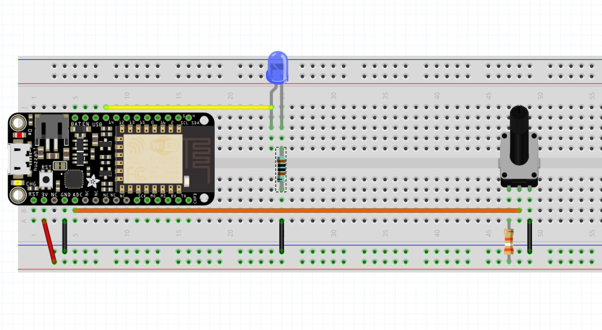
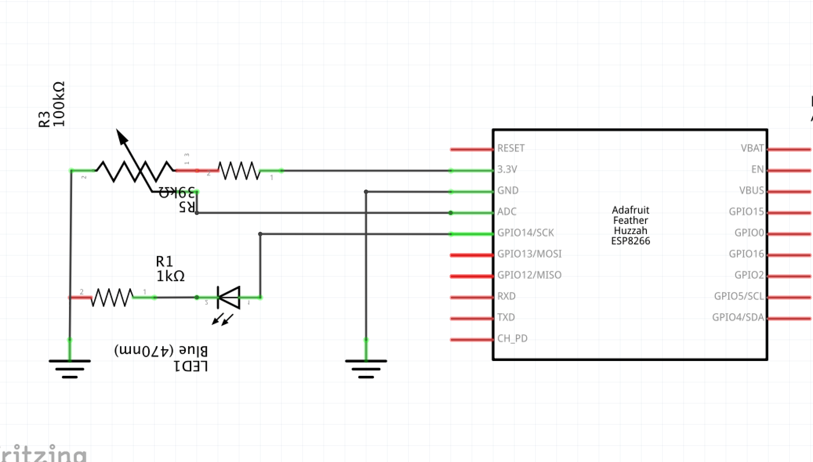

# Project 03 - Change the brightness of an LED with a potentiometer





```cpp
void setup()
{
    pinMode(LEDPIN, OUTPUT);
    pinMode(POTPIN, INPUT);
    Serial.begin(9600);
}

void loop()
{
    int value = analogRead(POTPIN);
    Serial.println(value);

    analogWrite(LEDPIN, value);
}
```
