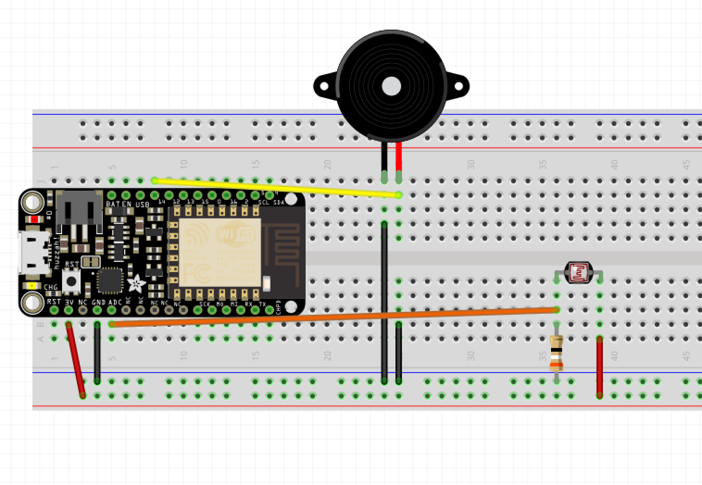
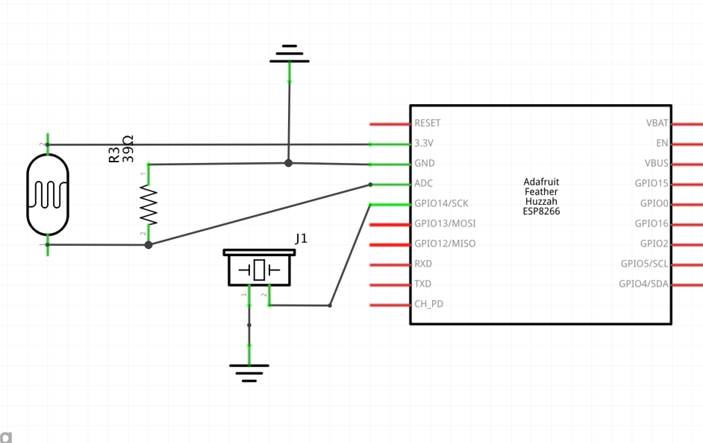

# Project 04 - Make light theramin using a photocell and a buzzer





These are effectively resistors, where the more light they sense, the lower their resistance.  They are cheap, but not precise.  Adafruit has a [full tutorial page](https://learn.adafruit.com/photocells) on them.

```cpp
void setup()
{
    pinMode(PHOTOPIN, INPUT);
    pinMode(BUZZPIN, OUTPUT);
    Serial.begin(9600);
}

void loop()
{
    int value = analogRead(PHOTOPIN);
    Serial.println(value);
    // values are 100 - 1000
    // desired is 200 - 500 Hz
    // we need code to scale the values to match the frequencies we want

    // map( current_value, min_value, max_value, min_desired, max_desired)
    int tone_freq = map(value, 100, 1000, 200, 500);

    tone(BUZZPIN, tone_freq);
}
```
