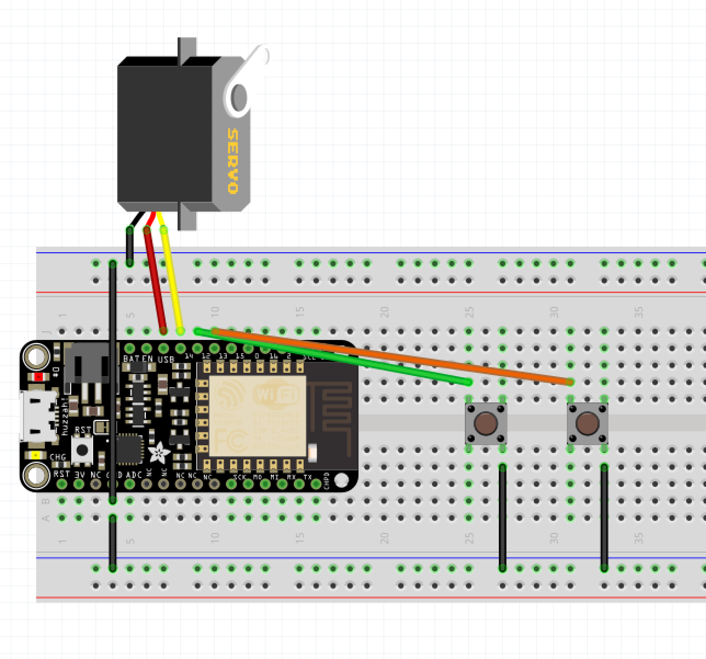
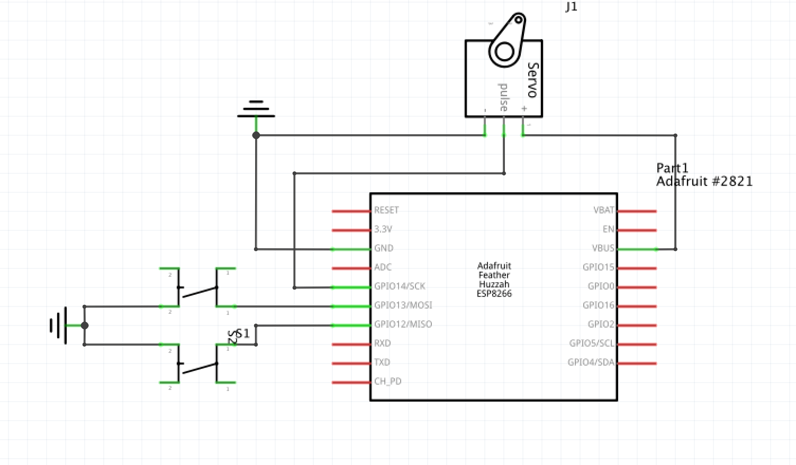

# Project 05 - Move a servo with buttons





Servos move through an arc, and can stop in discrete positions.

Adafruit has a tutorial with example code: [https://www.adafruit.com/product/169](https://www.adafruit.com/product/169)

The common Micro Servo Tower Pro SG92R has the following specs:

* Moves through a 180 degree arc
* Voltage : 3V to 6V DC
* Speed : 0.12 sec/60 (at 4.8V)
* Torque : 1.6 kg-cm

```cpp
#include <Servo.h>

const int SERVOPIN = 14;
const int L_BUTTON = 12;
const int R_BUTTON = 13;

Servo myServo;

float angle = 90; // servo position in degrees
float speed = 0.001;

void setup()
{
    myServo.attach(SERVOPIN);
    pinMode(L_BUTTON, INPUT_PULLUP);
    pinMode(R_BUTTON, INPUT_PULLUP);
    Serial.begin(9600);
}

void loop()
{
    int left = digitalRead(L_BUTTON);
    int right = digitalRead(R_BUTTON);

    if (left == LOW && right == LOW) {
        angle = 90;
    } else if (left == LOW) {
        angle -= speed;
    } else if (right == LOW) {
        angle += speed;
    }

    if (angle < 0) angle = 0;
    if (angle > 180) angle = 180;

    myServo.write(angle);

/*
    for (angle = 0; angle < 180; angle++) {
        myServo.write(angle);
        Serial.println(angle);
        delay(15);
    }

    for (angle = 180; angle > 0; angle--) {
        myServo.write(angle);
        Serial.println(angle);
        delay(15);
    }
*/
}
```
