# Intro to Microcontrollers

## Basic Electronic Theory

* Volts: The pressure of a charge or electrons that want to move through a circuit, as measured in the force required to hold back the charged particles (potential energy measured in Joules) times the number of charged particles (electrons) measured in Coulombs.

* Amps:  (Current, I) Rate of flow of charge measured in electrons (Coulombs) per sec.

* Resistance:  Amount of resistance to electron flow, measured in Ohms.  Resistors limit amperage, but not voltage.

```
V = I x R
```

Since you are usally powering your circuit with a source with a stable voltage (for instance a 9V battery), the amount of current flowing through the circuit depends on the amount of resistance provided by components in the circuit.

If there is a lot of resistance, the current (amps, I in the equation)
will be low.  

## Projects

* [00-simpleLED](00-simpleLED/guide.md) Wire up an LED and write code to make it blink.
* [01-pwmLED](01-pwmLED/guide.md) Use pulse width modulation to fade an LED.
* [02-buttonInput](02-buttonInput/guide.md) Use a button to light an LED.
* [03-analogRead](03-analogRead/guide.md) Use a potentiometer as an analog input.
* [04-photoSensor](04-photoSensor/guide.md) Make a light theramin, using a photocell as the analog input, and a buzzer as the analog output.
* [05-motionSensor](05-motionSensor/guide.md)

## Microcontrollers

* Adafruit Feather Huzzah 8266
	* pinout: https://learn.adafruit.com/adafruit-feather-huzzah-esp8266/pinouts
	* product page: https://www.adafruit.com/product/2821
	* tutorial page: https://learn.adafruit.com/adafruit-feather-huzzah-esp8266
	* kit with parts: https://www.adafruit.com/product/2680

## Accessories

* [Prototyping Boards](docs/prototyping_boards.md)
* [Wires](docs/wires.md)
* [Power](docs/power.md)

## Components

### Input

#### Binary Switches (and Buttons)

Image | Name | Supplier's Info | Symbol | Eagle Part | More Info 
----- | ---- | --------------- | ------ | ---------- | ---------
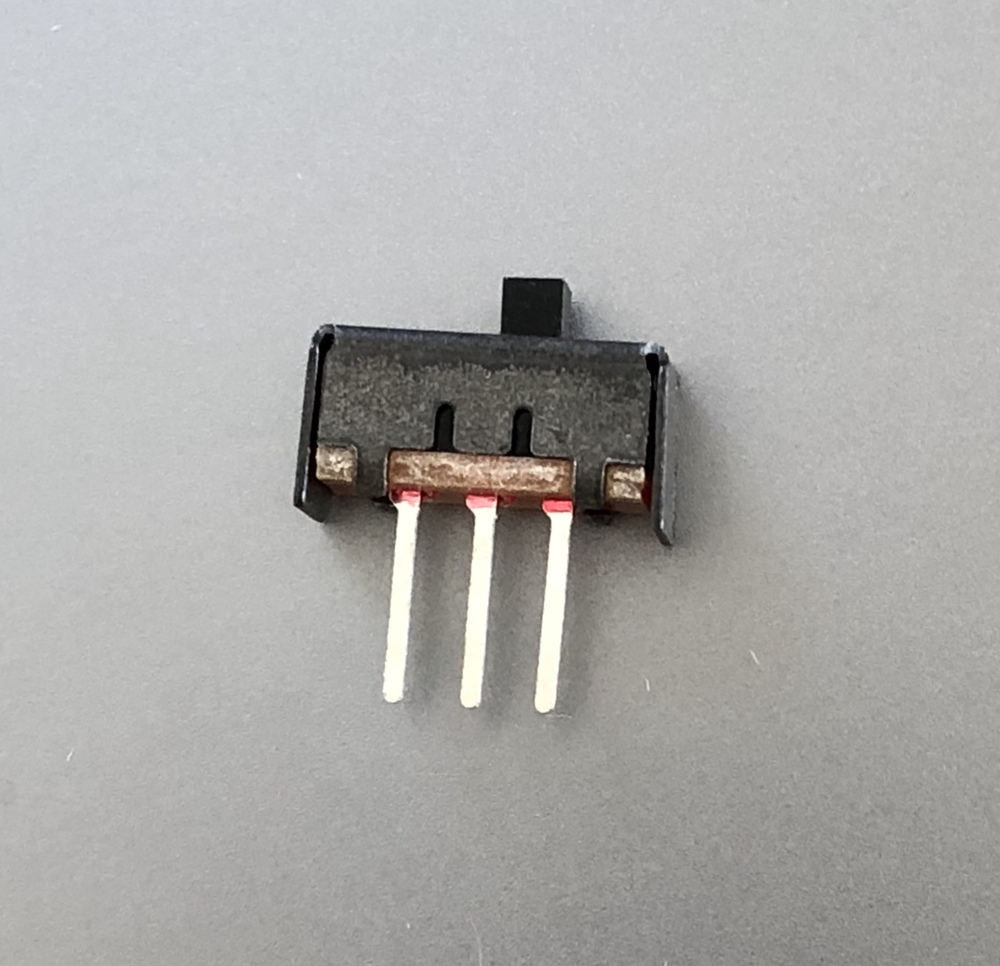 |  Slide Switch | [Adafruit documentation](https://www.adafruit.com/product/805) | 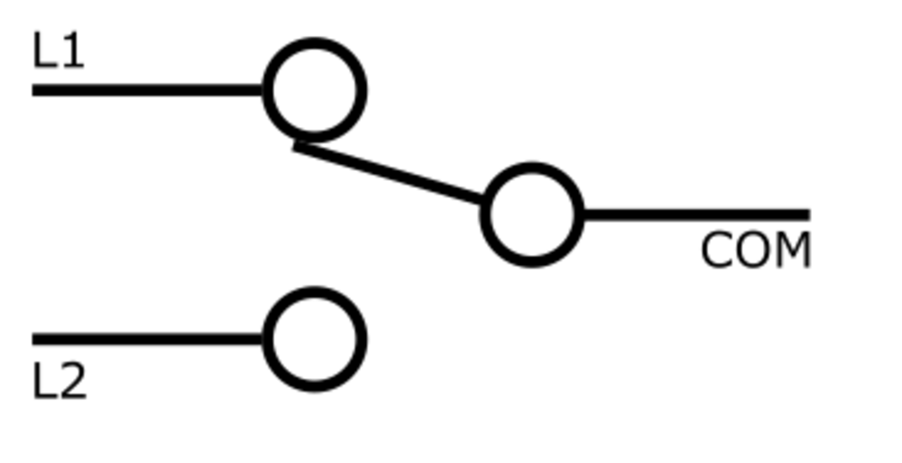 | |
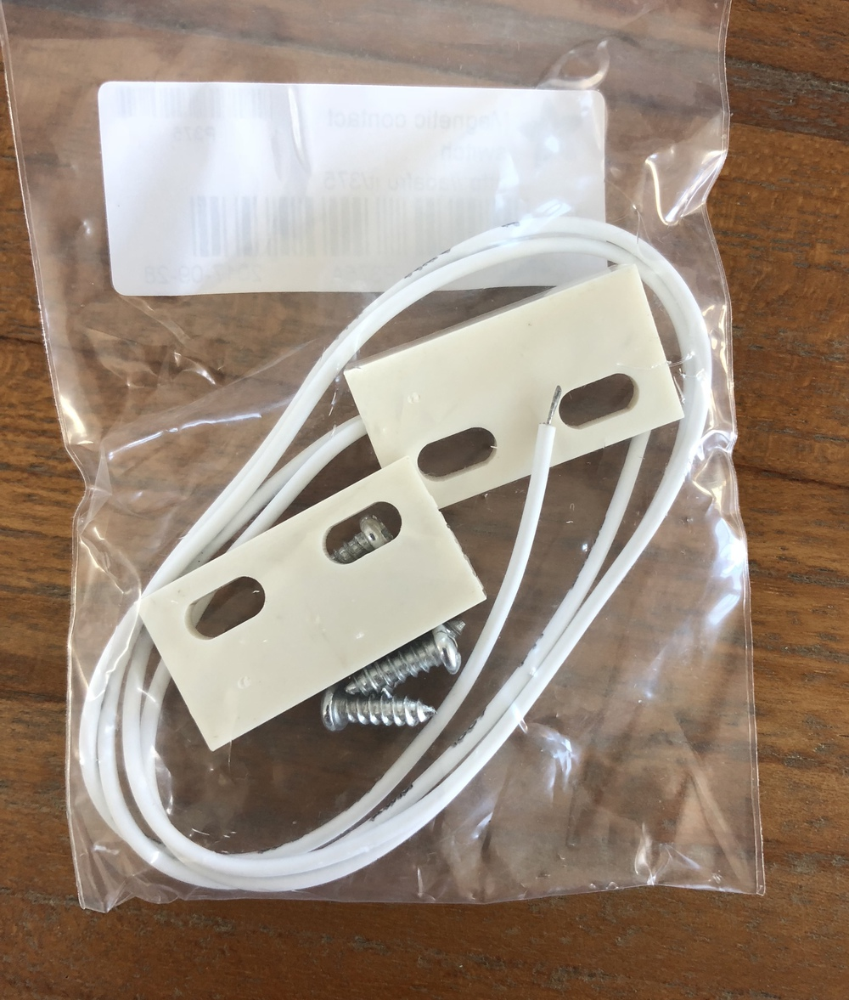 | Magnetic Contact Switch (Door Sensor) | [Adafruit documentation](https://www.adafruit.com/product/375) |
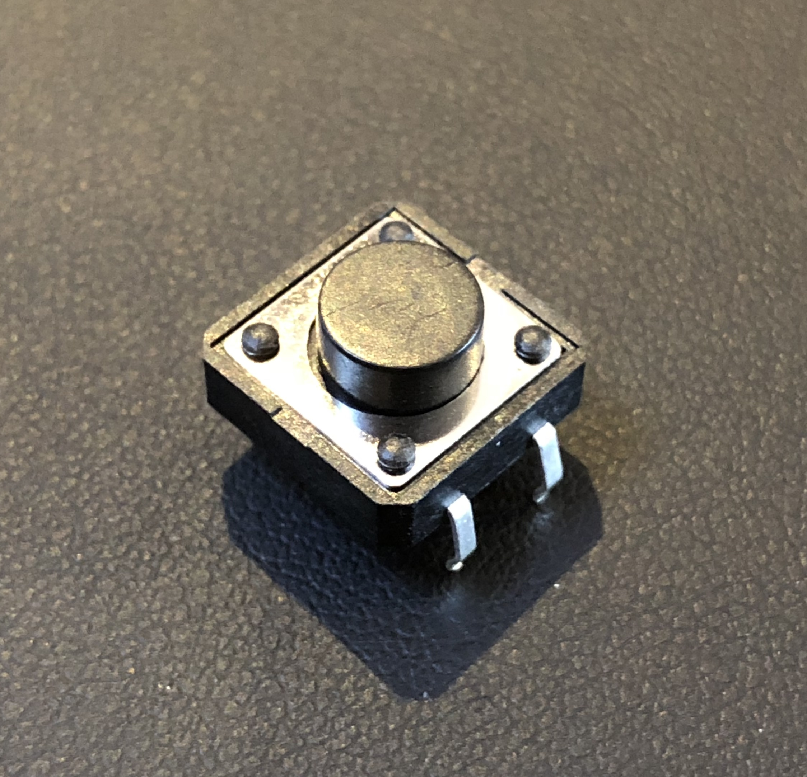 | Momentary Tactile Switch Button | [Adafruit documentation](https://www.adafruit.com/product/1119) | 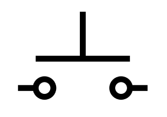 | switch-omron:B3F-40XX | 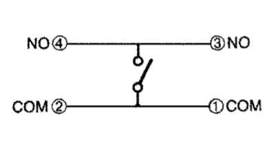 

#### Analog Switches

Image | Name | Supplier's Info | Symbol | Eagle Part | More Info 
----- | ---- | --------------- | ------ | ---------- | ---------
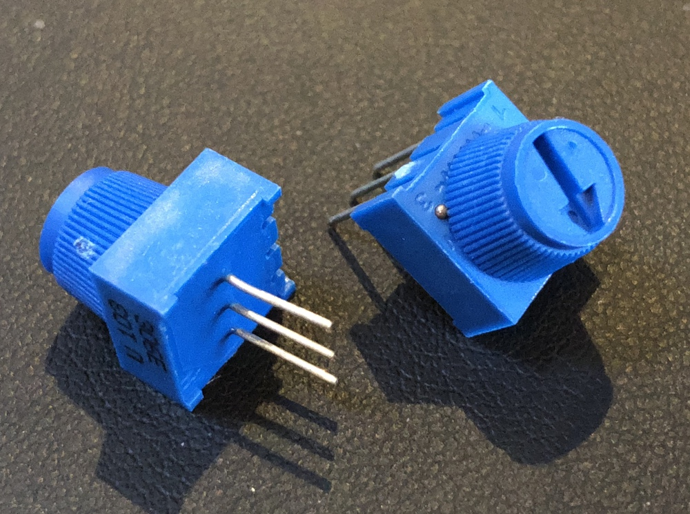 | Trim Potentiometer | [Adafruit documentation](https://www.adafruit.com/product/356) | 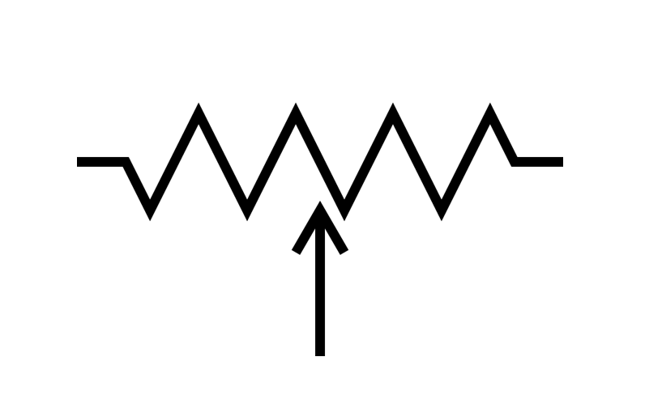 | | 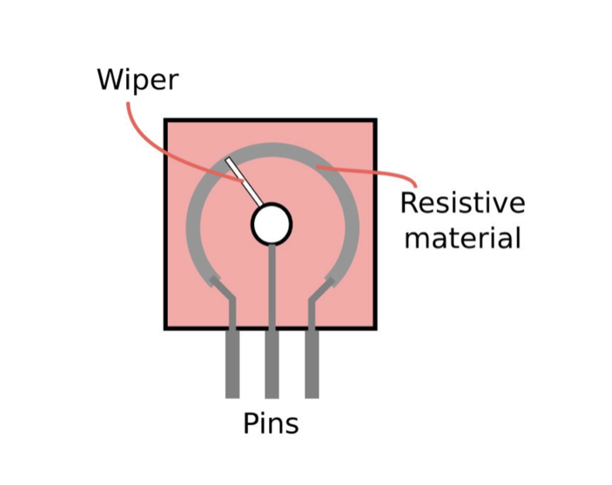 
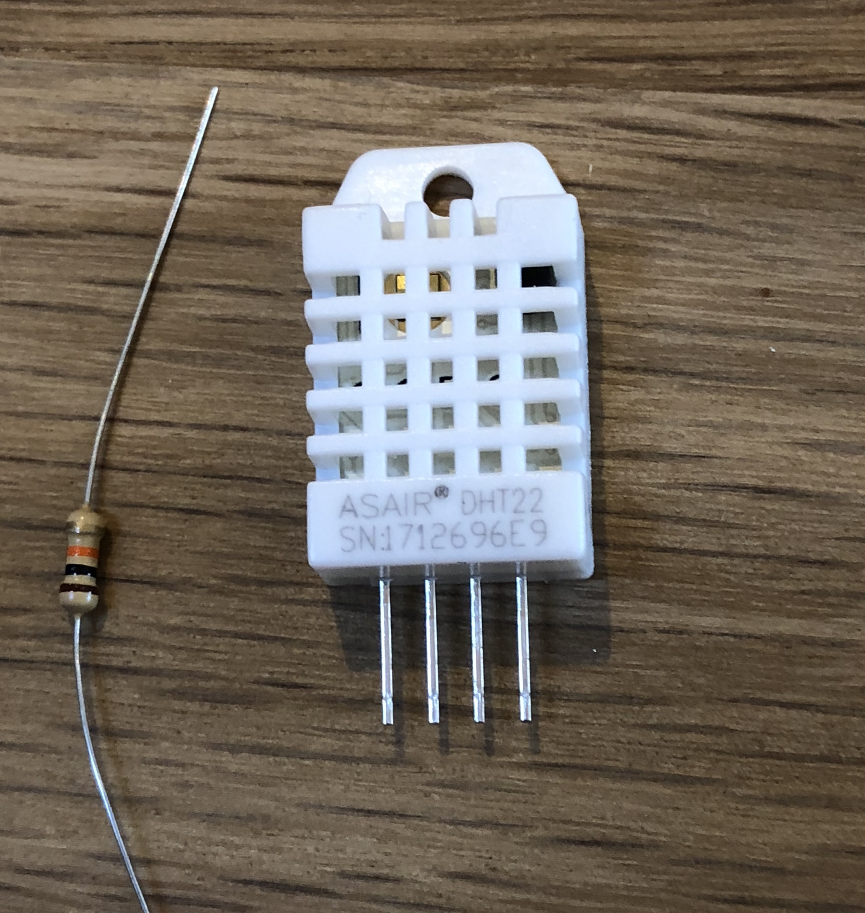 | Temperature and Humidity Sensor | [Adafruit documentation](https://www.adafruit.com/product/385) | | |
* [Motion Sensors]
* [Light Sensors]
* [Sound Sensors]

### Output

#### Light

Image | Name | Supplier's Info | Symbol | Eagle Part | More Info 
----- | ---- | --------------- | ------ | ---------- | ---------
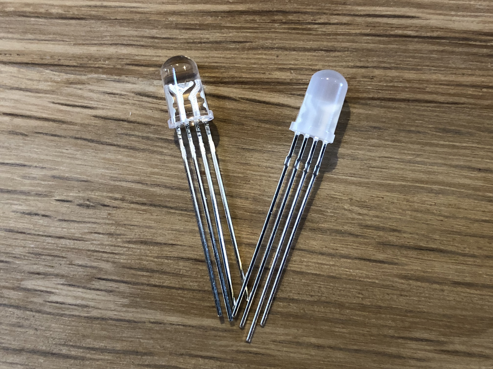 | RGB LEDs | [Adafruit documentation](https://www.adafruit.com/product/159) |  | |

#### Sound

* [Buzzers]

#### Motion

Image | Name | Supplier's Info | Symbol | Eagle Part | More Info 
----- | ---- | --------------- | ------ | ---------- | ---------
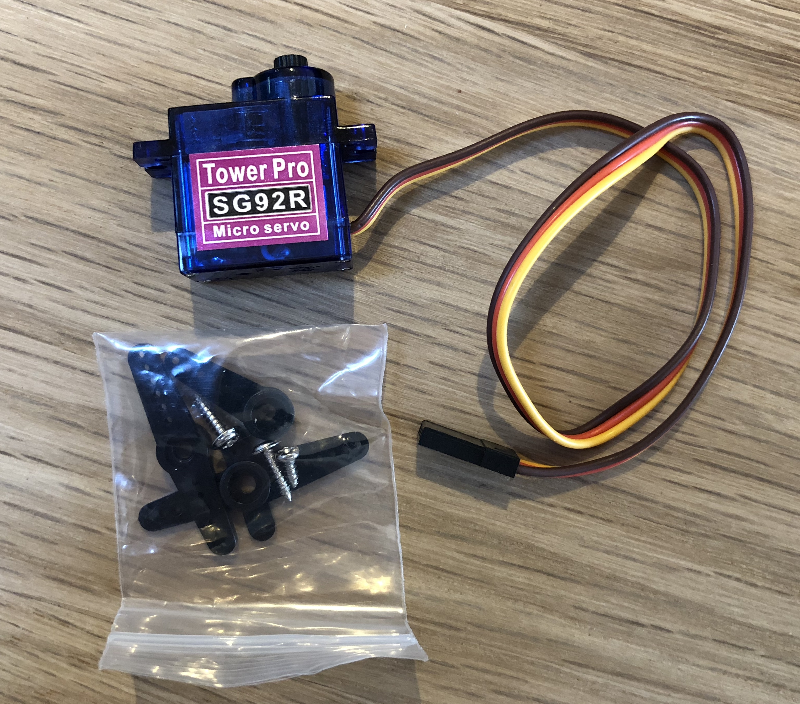 | Micro Servo | [Adafruit documentation](https://www.adafruit.com/product/169) | | |

### Neither

* [Resistors]
* [Capacitors]
* [Diodes]

## Image credits:

* [potentiometers from build-electronic-circuits.com](https://www.build-electronic-circuits.com/potentiometer/)
