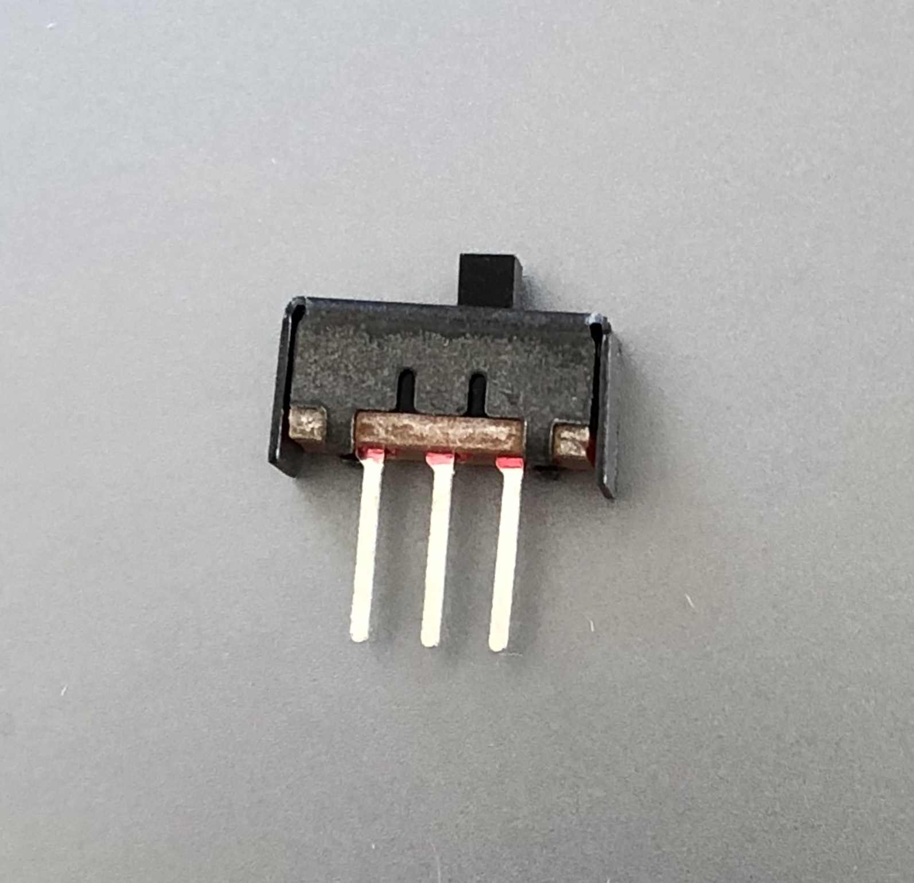

# Switches

## Slide Switches

### SPDT Slide Switch

Source: https://www.adafruit.com/product/805

The center pin is connected to either the left or right pin, depending on the position of the switch.

